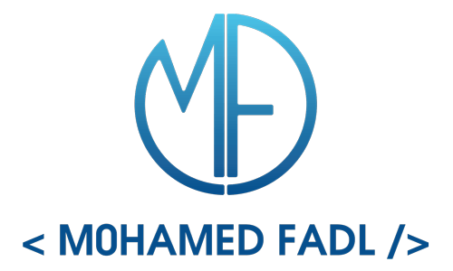

<p align="center">
  
</p>

<h2 align="center" style="font-weight: 300; color: #988e9f; margin-bottom: 25px;">&lt;About /&gt;</h2>

```javascript

class Mohamed_Fadl {
  /* -👋👋-
    Hello, I'm Mohamed Aboul-Fadl, a front-end web developer well-versed in HTML, CSS, JavaScript, and Vue.js, and I'm a beginner in back-end development.
    Keep a vision of becoming a full-fledged developer (Technology Stack: MEVN).
  */
  // I'm ambitious and love new challenges :)
  // My vast variety of skills is continuously expanding.

  constructor() {
    this.name = "Mohamed Aboul-Fadl"
    this.dayOfBirthTimestamp = 959482800000
    this.email = "Mohamed.Fadl2852@gmail.com"
    this.userName = "FADL285"
  }

  workExperience() {
    return [
      '...|',
      { "2020-present": "Freelance Front-End Developer" },
      { "2020-2023"   : "Front-End Developer @ Spider-Te8" },
      { "2019-2020"   : "Front-end Developer @ Alpha Egypt Group" }
    ]      
  }

  education() {
    return [
      { "2018-2022": "Computer Science, Bachelor's degree @ Mansoura University" },
      { "2020-2020": "Front End Web Developer (Nanodegree Program) @ Udacity - 4 Months" },
      { "2022-2022": "Full Stack JavaScript Developer (Nanodegree Program) @ Udacity - 4 Months" }
    ]
  }
  
  skills() {
    return [ 
      'HTML', 'CSS', 'JavaScript',
      'SASS', 'Bootstrap/TailwindCSS',
      'Vue.js', 'Nuxt.js', 'React', 'TypeScript',
      'Jest/Jasmine', 'Vitest', 'Cypress', // ->> Testing Tools
      'npm/yarn', 'Webpack/Vite', 'Git/GitHub',
      'Node.js', 'Express', 'MongoDB', 'PostgreSQL',
      'Python', 'WordPress', '...|'
    ]
  }
}
```
