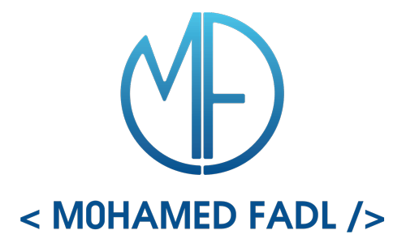

<p align="center">
  
</p>

<h2 align="center" style="font-weight: 300; color: #988e9f; margin-bottom: 25px;">&lt;About /&gt;</h2>

```javascript
class Mohamed_Fadl {
  ABOUT = `
    Hey 👋, I'm Mohamed AboulFadl — a Senior Front-End Engineer passionate about building 
    scalable, high-performance web applications and crafting smooth, user-focused experiences.

    I specialize in Vue.js, Nuxt.js, and TypeScript — and I love optimizing performance.

    I enjoy turning complex UI ideas into seamless, accessible, and elegant interfaces.
    Always learning, mentoring, and striving to make the web faster ⚡.
  `

  constructor() {
    this.name = "Mohamed AboulFadl"
    this.about = ABOUT
    this.email = "mohamed@fadl.info"
    this.userName = "FADL285"
    this.dayOfBirthTimestamp = 959482800000
    this.location = "Cairo, Egypt"
    this.role = "Senior Front-End Engineer"
    this.website = "https://fadl.info"
  }

  workExperience() {
    return [
      { "2026-present": "Software Engineer @ Robusta Studio" },
      { "2023-2026": "Software Engineer @ CyberDefenders" },
      { "2019-2023": "Front-End Engineer @ Spider-Te8" },
      { "2019-present": "Freelance Front-End Engineer" },
      { "2019-2020": "Front-End Engineer @ Alpha Egypt Group" }
    ]
  }

  education() {
    return [
      { "2018-2022": "B.Sc. in Computer Science @ Mansoura University" },
      { "Udacity": "Front-End Web Developer Nanodegree" },
      { "Udacity": "Full Stack JavaScript Developer Nanodegree" },
      { "Google": "IT Automation with Python Professional Certificate" }
    ]
  }

  certifications() {
    return [
      "Certified Senior Vue.js Developer",
      "Certified Mid-Level Vue.js Developer",
      "The Vue.js 3 Masterclass",
      "Mastering Nuxt 3",
      "Mastering Pinia"
    ]
  }

  skills() {
    return [
      // Core
      'HTML5', 'CSS3/SASS', 'JavaScript (ES6+)', 'TypeScript',

      // Frameworks
      'Vue.js', 'Nuxt.js', 'React.js', 'Next.js',

      // UI & Styling
      'Tailwind CSS', 'Bootstrap', 'Shadcn', 'Nuxt UI', 'PrimeVue',

      // State & Data
      'Pinia', 'Vuex', 'Zustand', 'TanStack Query',

      // Tools & Testing
      'Vite', 'Webpack', 'Git/GitHub', 'Jest', 'Vitest', 'Cypress',

      // Backend & APIs
      'Node.js', 'Express', 'RESTful APIs',

      // Other
      'Performance Optimization', 'Accessibility (WCAG)', 'Cross-Browser Compatibility'
    ]
  }

  volunteering() {
    return [
      { "Chairman": "IEEE Mansoura Computer Society Chapter (2022)" },
      { "Frontend Mentor": "CIS Team – Mansoura University (2021–2022)" }
    ]
  }
}
